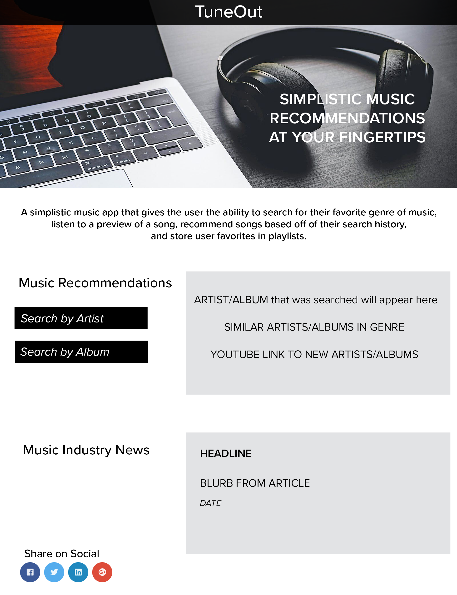
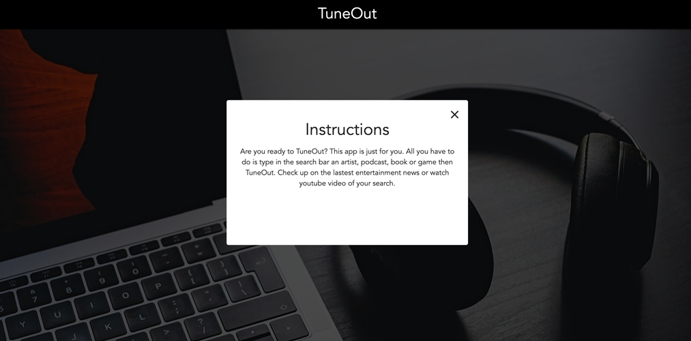
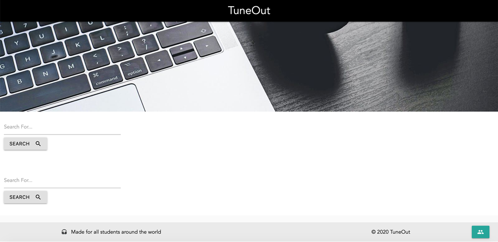

# TuneOut Entertainment App

## Table of Contents
* [User Story](#user-story)
* [Criteria](#criteria)
* [Technologies](#technologies)
* [Mockup](#mockup)
* [Screenshot](#screenshot)
* [Links](#links)

## User Story
AS A coding boot camp student  
I WANT to tune out by using an application that can search for my favorite music, books, podcasts and video games.  
SO THAT when I need a break or get stuck, I can TuneOut

## Criteria
GIVEN I need a distraction when my work gets overwhelming  
WHEN I go to the TuneOut app  
THEN I presented with a search option  
WHEN I enter in my favorite music/band, author/book, podcast or video game  
THEN I am presented with a description and YouTube link for my favorite search  
WHEN the description comes up on screen  
THEN the app shows recommendations in the same category as what I searched for  
WHEN I search for news, I am given categories of Music, Books or Movies  
THEN articles are displayed on the page 

## Technologies
1. HTML 
2. CSS 
3. JavaScript
4. Materialize CSS
5. Moment.js
6. TasteDive Music API
7. NY Times News API

## Mockup

## Screenshot

## Links
* [TuneOut Deployed Site Link](https://bspiewak6.github.io/music) 
* [TuneOut Github Repository](https://github.com/bspiewak6/music)
